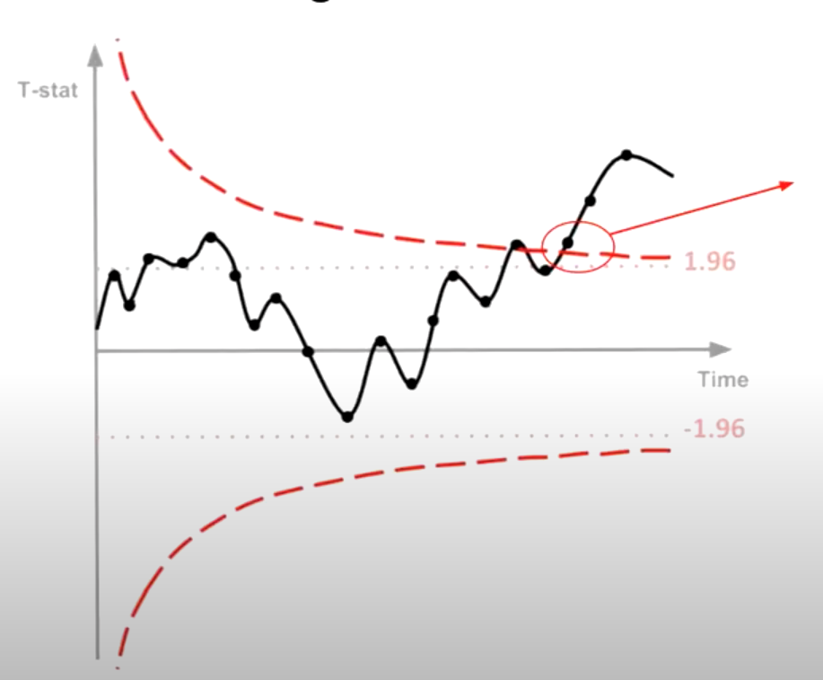

[My Resume](./resume.md) | [LinkedIn](https://www.linkedin.com/in/anshul-kumar-96570713a/) 

### [Filling in the Uber Supply-Demand Gap:](./Uber-supply-demand.md)

**Central Challenge:** Tackling a pronounced supply-demand imbalance in Uber's daily operations.

**Analytical Strategy:**
- Employed time-based segmentation to precisely isolate peak demand periods.
- Key Insights: Identified critical service bottlenecks during morning and evening rush hours.
- Recommendations: Devised a set of strategic interventions, ranging from driver incentives to ride pooling, aiming for holistic service optimization.

---

### [Let's work smarter and faster with our A/B testing:](./sequential_testing.md)

**The Dilemma:** While real-time data provides rapid insights, acting on it prematurely can lead to misleading results.
  
**Benefit of Sequential Testing:**
In essence, with Sequential Testing, businesses can confidently and profitably end their experiments early, ensuring they act on reliable data without unnecessary delays.

---

### [How to Prevent Churn:](./solution_telecom_churn.md)

**Objective:** Here we tackle the critical challenge of predicting customer churn in the telecom industry. Customer churn, or attrition, can significantly impact a business's revenue and growth. Our goal is to develop an effective predictive model that helps telecom companies identify customers at risk of churning and take proactive measures to retain them.

**Why It Matters:** Customer churn is a prevalent issue in the telecom industry. Identifying and retaining high-value customers can lead to increased customer lifetime value and sustained revenue streams. Our project empowers telecom companies with data-driven solutions to address this challenge.

---
