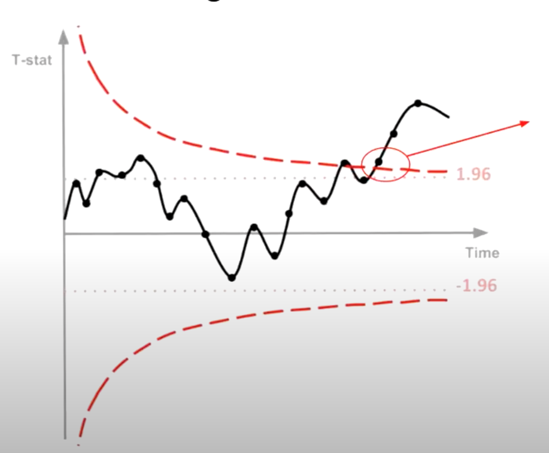

## Projects
### [Filling in the Uber Supply-Demand Gap](./Uber-supply-demand.md):

**Central Challenge:**
Tackling a pronounced supply-demand imbalance in Uber's daily operations.

**Analytical Strategy:**
- Employed time-based segmentation to precisely isolate peak demand periods.
- Key Insights: Identified critical service bottlenecks during morning and evening rush hours.
- Recommendations: Devised a set of strategic interventions, ranging from driver incentives to ride pooling, aiming for holistic service optimization.

---

### [Let's work smarter and faster with our A/B testing](./sequential_testing.md):

**The Dilemma:** While real-time data provides rapid insights, acting on it prematurely can lead to misleading results.
  
**Benefit of Sequential Testing:**
 In essence, with Sequential Testing, businesses can confidently and profitably end their experiments early, ensuring they act on reliable data without unnecessary delays.

---
