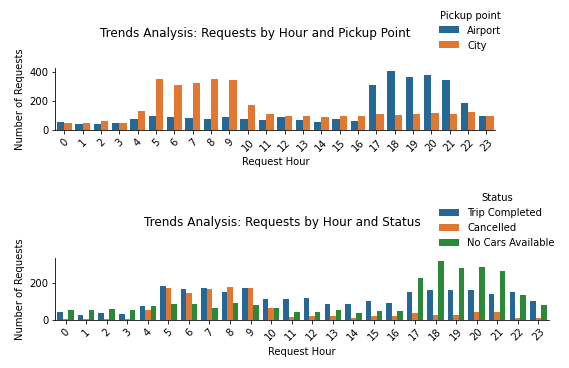
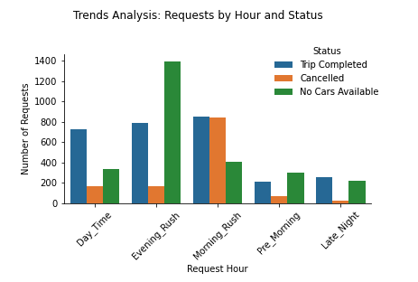
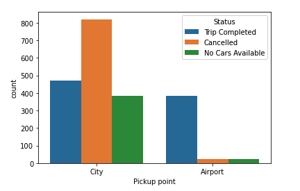
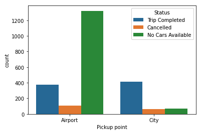

[⏪ Back](./)

# SOLVED - Uber Supply-Demand Gap

## Uber Supply-Demand Gap Analysis: Identifying Challenges & Proposing Solutions

### Introduction
This data science endeavor focuses on analyzing Uber's supply-demand gap, a critical concern 
impacting its service efficacy. The dataset chosen for this study provides deep insights through its six key columns.

#### Dataset Overview
- **Request.id**: A unique identifier for each request.
- **Pickup.point**: Location where the ride request was generated.
- **Driver.id**: Identifier for the driver assigned to the request.
- **Status**: Indicates the status of the request (e.g., completed, canceled).
- **Request.timestamp**: Time when the request was made.
- **Drop.timestamp**: Time when the request was completed.

### Trends Analysis
Upon analysis, it was observed that the pattern of requests is quite interesting, with 
high volumes during morning and evening rush hours. A significant number of trips are 
being **canceled in the early morning** hours and a large number of **no cars available** during the evening rush hours.

### Time Binning
To better understand the flow of requests throughout the day, time was segmented into:
- **Pre_Morning**: 12 AM – 5 AM
- **Morning_Rush**: 5 AM – 10 AM
- **Day_Time**: 10 AM – 5 PM
- **Evening_Rush**: 5 PM – 10 PM

Post-segmentation, a clearer image of the supply-demand challenge emerged. Two bars, one green and one orange, 
were particularly prominent. These bars are indicative of the challenges faced during the Evening and Morning rush hours.

#### Morning Rush: City to Airport Cancellations

The data visualization pertaining to the status of trips during the **morning rush** offers an enlightening perspective on the operational challenges Uber faces in this timeframe. It is evident from the dataset:

- The morning hours, especially in the rush, witness a notable surge in ride requests, predominantly from the city heading towards the airport. This can be attributed to numerous reasons such as early flights, business commutes, or individuals trying to avoid the peak city traffic.

- However, a significant portion of these requests never culminate into a completed ride. The primary reason for this mismatch between demand and supply is the high rate of cancellations. Such cancellations can be spurred by various factors:
  - **Driver Concerns**: Drivers might be hesitant to accept these rides due to the apprehension about getting stuck in the traffic, longer waiting times at the airport, or the uncertainty of securing a fare for the return trip.
  - **Passenger Concerns**: There might be instances where passengers cancel due to long estimated arrival times of the cars, opting for quicker alternatives.

#### Evening Rush: Car Availability at the Airport

The scenario shifts quite drastically when we analyze the **evening rush** data. Key insights include:

- During the evening rush, there is a pronounced demand for rides originating from the airport and heading into the city. This can be due to factors like incoming flights, tourists trying to reach their accommodations, or professionals returning from their business trips.

- However, there is a marked discrepancy in the availability of cars to meet this demand. A substantial number of passengers at the airport are left waiting due to "no cars available" status. This poses not just a service inefficiency for Uber but also a potential loss of trust and revenue.

- The shortage of cars could stem from several reasons:
  - **Misaligned Inbound and Outbound Trips**: If cars that drop passengers off at the airport in the morning don't align with the demand in the evening, it can lead to a car deficit.
  - **High Demand Elsewhere**: Drivers might be occupied serving high-demand areas in the city, making them unavailable at the airport.
  - **Operational Challenges**: Factors such as limited parking spaces, longer waiting times due to stringent security checks at the airport, or even the distance of the airport from the city center might deter drivers from being readily available at the airport.

### **Key Trends Observed from Binning**:

- **City to Airport Morning Cancellations**: 
  During the morning rush hours, a significant trend emerged regarding trips from the city to the airport. A major chunk of these rides was canceled. This might hint towards drivers being hesitant due to factors like potential traffic congestion, longer wait times at the airport, or the possibility of not securing a return fare once at the airport.

- **Airport to City Evening Availability Issues**:
  The evening rush hours painted a contrasting picture. Majority of requests from the airport to the city encountered issues with car unavailability. This suggests that there might not be enough drivers around the airport during these hours, potentially due to previous rides taking them far away from the airport or a mismatch between inbound and outbound rides.

### **Key Findings**:

- **Morning Requests from City**:
  A large volume of Uber requests generated from the city during the morning rush hours, possibly due to the need to catch early flights or avoid the city's peak traffic hours.

- **Evening Requests from Airport**:
  The evenings saw a surge in demand at the airport. This could be attributed to incoming flights, tourists looking to get to their accommodations, or business travelers returning from trips.

### **Problem Identification**:

- **Morning Rush Challenges**: 
  About 50% of the trips from the city in the mornings were canceled. This represents a significant loss of potential revenue and can lead to customer dissatisfaction.

- **Evening Rush Challenges**: 
  Car availability became a major bottleneck during the evening rush hours at the airport. Around 70% of the requests were unfulfilled due to the lack of available cars, causing inconvenience for passengers and missed opportunities for Uber.

### 🎯 **Recommendations**:

**Morning Rush Solutions**:

- **Incentivize Drivers**: 
  Offering bonuses or higher fare rates for each completed city-to-airport trip during the morning rush can act as a lucrative incentive for drivers to accept and complete these rides.

- **Gas Mileage Compensation**: 
  Uber could introduce a scheme where drivers are compensated for the gas mileage on their return trips, especially if they don't get a fare on the way back. This can ease the financial concerns drivers might have regarding empty returns.

- **Boost Airport Demand**: 
  Through targeted marketing efforts and promotional price cuts, Uber can boost the demand for rides from the airport in the morning. This ensures drivers that there will be potential passengers waiting, making their trip to the airport more profitable.

**Evening Rush Solutions**:

- **Driver Bonuses**: 
  Offering special bonuses or incentives for drivers willing to operate around the airport during evening rush hours can help in increasing car availability.

- **Compensate Empty Trips**: 
  A system that compensates drivers for passenger-less trips to the airport in anticipation of the evening rush can be beneficial. It can ensure a steady supply of cars at the airport when demand spikes.

- **Ride Pooling**: 
  Introducing or promoting ride-pooling options can ensure that fewer cars can serve more passengers. Not only does this optimize the supply of cars, but it also offers passengers a more affordable ride option.

[⏪ Back](./)
